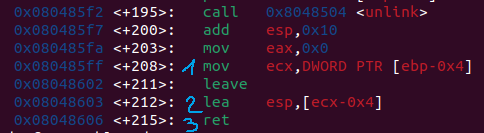

תרגיל שמתעסק בunlink exploit ובפרימיטיב aa4bmo (almost arbitrary 4 bytes mirrored overwrite).

בתרגיל מוגדרים 3 אובייקטים A, B, C במבנה הבא:

    Fd (4 bytes)
     
    Bk (4 bytes)
     
    Buf (8 bytes)

לאחר מכן מחברים אותם לשרשרת דו כיוונית כך ש A <-> B <-> C.
לאחר מכן נקבל leak לstack address ולheap address.

אחרי זה יש
Gets(A->buf)
(מה שמאפשר לנו לדרוס את fd, bk של B ובעצם כל מה שבא לאחר מכן בheap.
לבסוף יש קריאה לפונקציה Unlink על B שבפועל עושה:

    [FD + 4] = BK
     
    [BK] = FD
     
    (aa4bmo)

בנוסף מוגדרת פונקציית shell שקוראת לsystem("/bin/sh").
הפונקציה נמצאת ב0x080484eb

בסוף פונקציית main יש את השורות הבאות:

נרצה לגרום לכך שבשורה האחרונה הכתובת שתהיה בesp תפנה לכתובת של shell. כי (3)
  
לכן נרצה שבecx תהיה כתובת שמפנה לכתובת של shell פלוס 0x4. (כלומר אם הכתובת שמפנה לכתובת של shell היא 0xABCDEF0 נרצה שבecx יהיה הערך 0xABCDEF4. כי (2)

לכן נרצה שהכתובת שנמצאת 4 בתים לפני הכתובת שנמצאת בebp תפנה לכתובת 0xABCDEF4. כי (1)

מדיבוג אפשר למצוא שהכתובת שנמצאת 4 בתים לפני הכתובת בebp היא stack address + 0x10.
לכן בbk נשים את stack address + 0x10.

כעת נרצה לשים על הheap את הכתובת של shell ובfd לשים את הכתובת בheap בה שמנו את הכתובת של shell.
ולכן מה שנכתוב בgets הוא:
JUNK + fd + bk + JUNK + shell_address
אנחנו בכוונה שמים את shell address עמוק בתוך הheap מפני שהכתובת בheap נטענת לesp וזה עלול לגרום לקריסה מפני שמניחים בsystem שאפשר להחסיר ערך גדול מesp.

במכונה לוקאלית לעומת בשרת, הגודל של הצ'אנקים שמוקצים בheap שונים ולכן יש לשנות את הגדלים של JUNK ולכן גם את הערך של fd.

